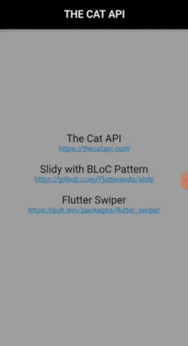

# Silver Cat Swiper

An example of SilverAppBar with a cats' swiper using BLoC and Slidy

## Getting Started

A few resources to get you started if this is your first Flutter project:

- [Lab: Write your first Flutter app](https://flutter.dev/docs/get-started/codelab)
- [Cookbook: Useful Flutter samples](https://flutter.dev/docs/cookbook)

### Packages in this project:

- Slidy and BLoC
https://github.com/Flutterando/slidy

- SliverAppBar
https://api.flutter.dev/flutter/material/SliverAppBar-class.html

- Flutter Swiper
https://pub.dev/packages/flutter_swiper

### API:

- TheCatAPI
https://thecatapi.com/
